# 🎙️ Prompt Studio
<div align="center">

[](https://opensource.org/licenses/MIT)
[](https://www.python.org/downloads/release/python-3110/)
[](https://ghcr.io/pilvicontactcenter/prompt-studio)
[](https://github.com/psf/black)
[](https://www.genesys.com)

**Create professional audio prompts for your Genesys Cloud contact center in minutes, not hours.**
*Deployed with 2025 Best Practices: Secured, Containerized, and CI/CD Integrated.*

</div>

**Create professional audio prompts for your Genesys Cloud contact center in minutes, not hours.**

Prompt Studio is a web application that streamlines the creation and management of IVR audio prompts. Whether you need to generate text-to-speech messages, record your own voice, or upload existing audio files — Prompt Studio handles it all and exports directly to Genesys Cloud.

---

## 🎯 Why Prompt Studio?

Managing IVR prompts in a contact center can be time-consuming:

- Recording prompts requires coordination with voice talent
- Updating a single word means re-recording the entire message
- Uploading files to Genesys Cloud involves multiple steps
- Keeping track of prompt versions is challenging

**Prompt Studio solves these problems by providing a single, intuitive interface for all your prompt needs.**

---

## 🔄 How It Works


---

## ✨ Key Features

### 🗣️ Text-to-Speech Generation
Convert written text into natural-sounding audio using Azure's Neural voices. Perfect for:
- Quick prompt updates
- Multi-language support
- Consistent voice quality across all prompts

### 🎤 Voice Recording
Record directly in your browser — no external software needed. Ideal for:
- Personal greetings
- Custom announcements
- Brand-specific voice requirements

### 📁 File Import
Upload existing WAV files from your computer or professional recording studio.

### ☁️ One-Click Export
Send your finished prompt directly to Genesys Cloud Architect with a single click. No more manual file uploads!

### 🏗️ Modern 2025 Architecture
Built with the latest web standards:
- **Frontend**: Clean, lightweight interface using **CSS Variables** (Spark Design) and **Vanilla JS** (Zero dependencies).
- **Backend**: Python 3.11 + Flask 3.x, optimized for speed.
- **Security**: Non-root container execution, strict multi-stage builds, and secure session management.
- **Deploy**: Cloud-native Docker container optimized for Gunicorn.

---

## 👥 User Journey


---

## 🏗️ Architecture Overview


---

## 🔐 Authentication Flow

Prompt Studio supports two authentication modes:

### Standalone Mode (Browser)
When accessed directly in a web browser, users sign in via Genesys Cloud OAuth.

### Embedded Mode (Genesys Cloud)
When embedded as a Client App within Genesys Cloud, authentication is automatic — no login required!


### 📸 Embedded Mode Preview

Here's how Prompt Studio looks when embedded as a Client App inside Genesys Cloud:

<p align="center">
  
</p>

*Seamlessly integrated with the Genesys Cloud interface — users can create and manage prompts without leaving their workspace!*

---

## 🌍 Supported Languages

Export prompts in any language supported by Genesys Cloud:

| Language | Code | Language | Code |
|----------|------|----------|------|
| English (US) | `en-us` | German | `de-de` |
| English (UK) | `en-gb` | French | `fr-fr` |
| Spanish | `es-es` | Italian | `it-it` |
| Portuguese | `pt-br` | Dutch | `nl-nl` |
| Polish | `pl-pl` | Japanese | `ja-jp` |

*...and many more!*

---

## 🚀 Getting Started

### Prerequisites

- Azure Cognitive Services account (for Text-to-Speech)
- Genesys Cloud organization with:
  - OAuth Client (Authorization Code) for user login
  - OAuth Client (Client Credentials) for API operations
  - Architect permissions

Choose your deployment method below:

---

## 🐳 Option A: Docker (Recommended)

The fastest way to get started — no building required! We provide pre-built Docker images.

### Quick Start with Pre-built Image

1. **Create a directory and download files**
   ```bash
   mkdir prompt-studio && cd prompt-studio
   
   # Download required files
   curl -O https://raw.githubusercontent.com/PilviContactCenter/GenesysCloudPromptGeneration/main/docker-compose.prod.yml
   curl -O https://raw.githubusercontent.com/PilviContactCenter/GenesysCloudPromptGeneration/main/.env.example
   curl -O https://raw.githubusercontent.com/PilviContactCenter/GenesysCloudPromptGeneration/main/scripts/update.sh
   chmod +x update.sh
   ```

2. **Configure environment**
   ```bash
   cp .env.example .env
   nano .env  # Edit with your credentials
   ```

3. **Run the application**
   ```bash
   docker-compose -f docker-compose.prod.yml up -d
   ```

4. **Access the application**
   ```
   http://localhost:5001
   ```

### Updating to Latest Version

```bash
./update.sh
```

Or manually:
```bash
docker pull ghcr.io/pilvicontactcenter/prompt-studio:latest
docker-compose -f docker-compose.prod.yml down
docker-compose -f docker-compose.prod.yml up -d
```

---

## 🐳 Option B: Docker (Build from Source)

For contributors or customization, build the image locally.

### Build and Run

1. **Clone the repository**
   ```bash
   git clone https://github.com/PilviContactCenter/GenesysCloudPromptGeneration.git
   cd GenesysCloudPromptGeneration
   ```

2. **Configure environment**
   ```bash
   cp .env.example .env
   # Edit .env with your credentials
   ```

3. **Build and run**
   ```bash
   docker-compose up -d --build
   ```

4. **Access the application**
   ```
   http://localhost:5001
   ```

### Docker Commands

```bash
# Build the image
docker build -t prompt-studio .

# Run the container
docker run -d \
  --name prompt-studio \
  -p 5001:5001 \
  --env-file .env \
  -v $(pwd)/uploads:/app/uploads \
  prompt-studio

# View logs
docker logs -f prompt-studio

# Stop the container
docker-compose down
```

---

## 🐍 Option C: Local Python (Development)

Run directly with Python for development and debugging.

### Setup

1. **Clone the repository**
   ```bash
   git clone https://github.com/PilviContactCenter/GenesysCloudPromptGeneration.git
   cd GenesysCloudPromptGeneration
   ```

2. **Install dependencies** (Python 3.9+ required)
   ```bash
   pip install -r requirements.txt
   ```

3. **Configure environment**
   ```bash
   cp .env.example .env
   # Edit .env with your credentials
   ```

4. **Run the application**
   ```bash
   python app.py
   ```

5. **Open in browser**
   ```
   http://localhost:5001
   ```

---

## 🏭 Production Deployment

For production, consider:
- Using a reverse proxy (Caddy/nginx) for HTTPS
- Setting `OAUTH_REDIRECT_URI` to your production URL
- Using persistent volumes for uploads and database
- Configuring proper security headers

## ⚙️ Configuration

Copy `.env.example` to `.env` and configure:

| Variable | Description |
|----------|-------------|
| `AZURE_SPEECH_KEY` | Your Azure Speech Services API key |
| `AZURE_SPEECH_REGION` | Azure region (e.g., `westeurope`) |
| `GENESYS_CLIENT_ID` | Client Credentials OAuth client ID |
| `GENESYS_CLIENT_SECRET` | Client Credentials OAuth client secret |
| `OAUTH_CLIENT_ID` | Authorization Code OAuth client ID |
| `OAUTH_CLIENT_SECRET` | Authorization Code OAuth client secret |
| `GENESYS_BASE_URL` | Genesys Cloud region (e.g., `mypurecloud.de`) |

---

## 📂 Project Structure

```
PromptGeneration/
├── .github/
│   └── workflows/
│       └── docker-publish.yml    # CI/CD: Auto-build and publish to GHCR
├── app.py                        # Main Flask application (session-based auth)
├── config.py                     # Configuration settings
├── Dockerfile                    # Docker build configuration
├── docker-compose.yml            # Development compose file
├── docker-compose.prod.yml       # Production compose (pre-built image)
├── docker-compose.watchtower.yml # Auto-update configuration
├── scripts/
│   └── update.sh                 # Manual update script
├── services/
│   ├── azure_tts.py              # Azure Text-to-Speech integration
│   └── genesys_export.py         # Genesys Cloud Architect export
├── static/
│   ├── css/spark.css             # Genesys Spark design system
│   └── js/main.js                # Frontend JavaScript
├── templates/
│   ├── index.html                # Main application page
│   └── login.html                # OAuth login page
└── uploads/                      # Temporary audio file storage
```

---

## 🔄 CI/CD Pipeline

This project uses **GitHub Actions** for automated builds and **Watchtower** for automatic container updates.

### CI/CD Flow

```mermaid
flowchart LR
    subgraph Developer["👨‍💻 Developer"]
        A[Push to main]
    end
    
    subgraph GitHub["⚙️ GitHub Actions"]
        B[Build Docker Image]
        C[Push to GHCR]
    end
    
    subgraph Server["🖧 Production Server"]
        D[Watchtower detects update]
        E[Pull optimized image]
        F[Restart container]
    end
    
    A --> B
    B --> C
    C --> D
    D --> E
    E --> F
    
    style A fill:#ff4f1f,color:#fff
    style C fill:#6e5494,color:#fff
    style F fill:#1fa343,color:#fff
```



### How It Works

1. **Push to `main` branch** → GitHub Actions automatically builds a new Docker image
2. **Image published** → Pushed to GitHub Container Registry (`ghcr.io/pilvicontactcenter/prompt-studio`)
3. **Watchtower detects** → Checks for new images every 5 minutes
4. **Auto-update** → Pulls and restarts the container with zero downtime

### Image Tags

| Tag | Description |
|-----|-------------|
| `latest` | Most recent build from main branch |
| `sha-xxxxxx` | Build from specific commit (for rollback) |
| `YYYYMMDD-HHmm` | Timestamp-based version |

### Setting Up Watchtower (Auto-Updates)

For fully automated updates on your server:

```bash
# Start Watchtower alongside your app
docker-compose -f docker-compose.prod.yml -f docker-compose.watchtower.yml up -d
```

Watchtower will:
- Check for new images every 5 minutes
- Automatically pull and restart the container
- Clean up old images

### Manual Update

If you prefer manual control:

```bash
# Using the update script
./update.sh

# Or manually
docker pull ghcr.io/pilvicontactcenter/prompt-studio:latest
docker-compose -f docker-compose.prod.yml down
docker-compose -f docker-compose.prod.yml up -d
```

### Rollback to Previous Version

```bash
# List available tags
docker images ghcr.io/pilvicontactcenter/prompt-studio

# Roll back to specific version
docker-compose -f docker-compose.prod.yml down
docker pull ghcr.io/pilvicontactcenter/prompt-studio:sha-abc1234
# Edit docker-compose.prod.yml to use the specific tag, then:
docker-compose -f docker-compose.prod.yml up -d
```

---

## 🎨 Design

Prompt Studio follows the **Genesys Spark Design System**, ensuring a consistent look and feel with other Genesys Cloud applications.

---

## 📜 License

MIT License

---

## 🤝 Contributing

Contributions are welcome! Please feel free to submit a Pull Request.

---

## ☕ Support This Project

Building tools like Prompt Studio takes countless hours of coding, debugging, and drinking coffee. ☕

If this project saved you time or made your life easier, consider buying me a coffee! Your support helps keep the development going and the coffee pot full.

<p align="center">
  <a href="https://ko-fi.com/pilvi_pl" target="_blank">
    
  </a>
</p>

**Every coffee counts!** Whether it's a single espresso or a fancy latte, your contribution means the world. 🙏

---

<p align="center">
  <strong>Powered by Pilvi</strong><br>
  <em>Making contact center management simpler</em>
</p>
